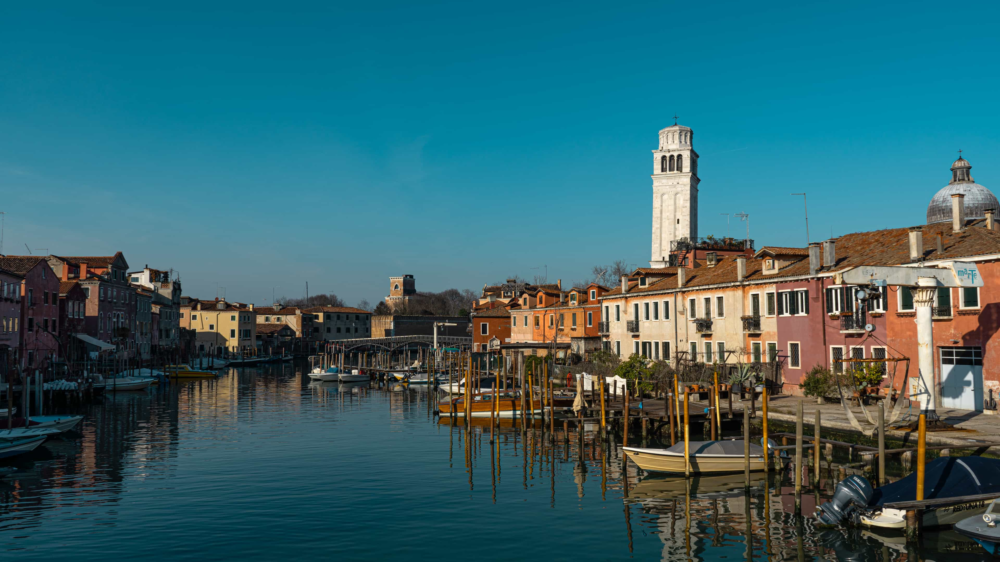
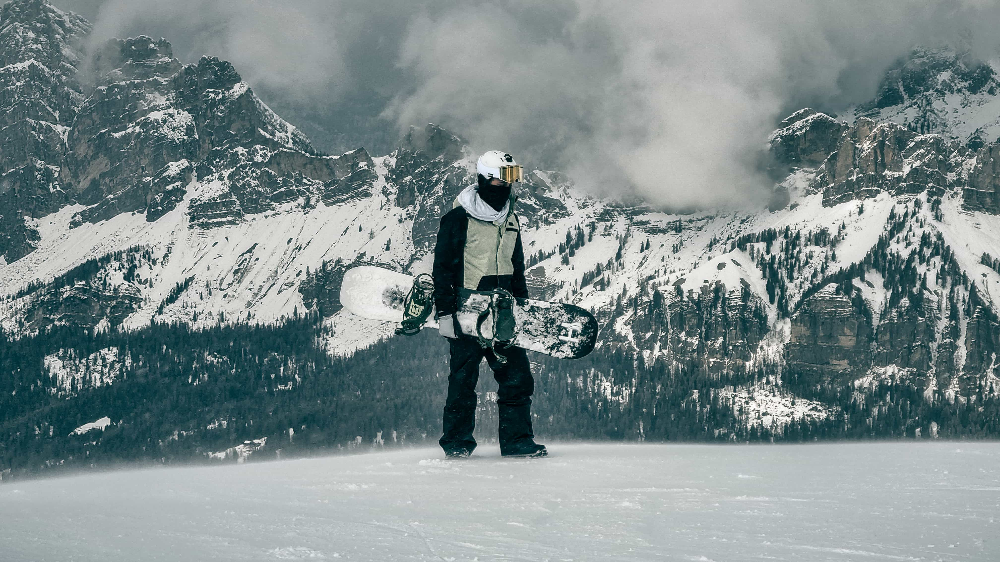
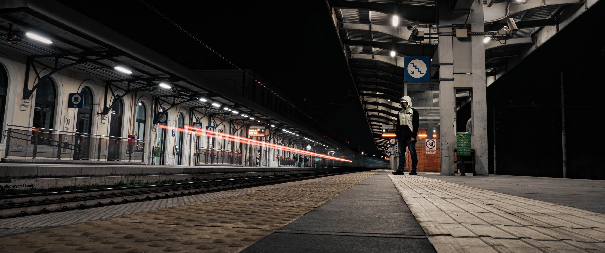

These images should render as a coherent justified image grid.

While this image below renders as a normal single image.

Test text.

Some image grids again.

Some text. One image should show up after this as the complementary rest images.